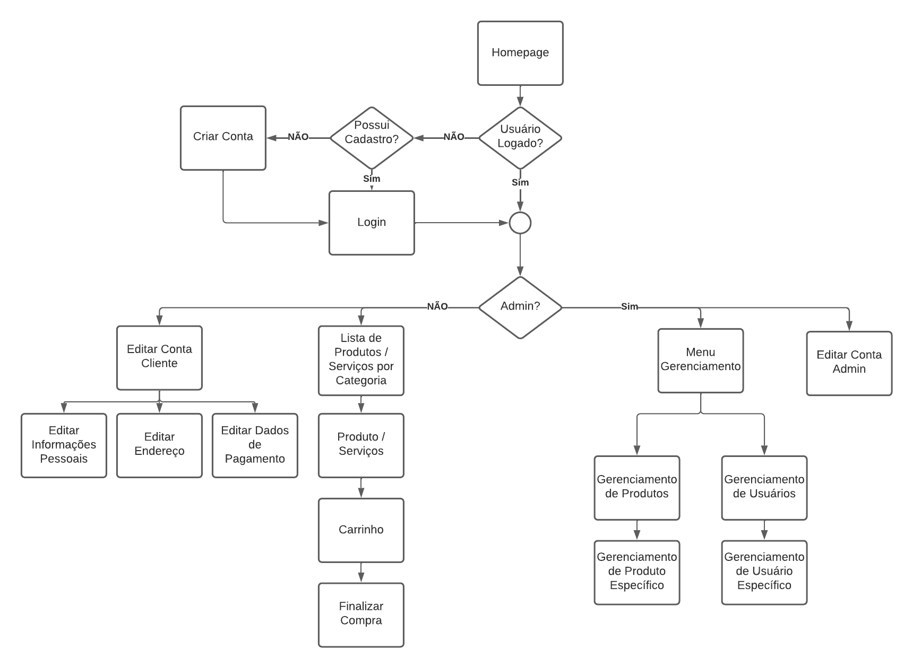

# Projeto Web - AZULÃO PETSHOP

<p align="justify">
    Projeto da disciplina Introdução ao Desenvolvimento Web - SCC0219.<br>
    Foi decidido pelo grupo que o website a ser desenvolvido seria um petshop virtual.
</p><br>

## Autores:
- Felipe Cadavez Oliveira - 11208558

- Gustavo Lelli Guirao - 11918182

- Luiz Fernando Rabelo - 11796893
<br><br><br>

## 1. Requisitos

<p align="justify">
    O sistema deve ter 2 tipos de usuários: clientes e administradores.<br>
    Os administradores são responsáveis por registrar/gerenciar clientes, produtos e serviços fornecidos. O aplicativo já vem com uma conta "admin" com senha "admin".<br>
    Clientes são usuários que acessam o sistema para comprar produtos e/ou serviços.<br>
    O registro de cada cliente contém nome, CPF, gênero, telefone e e-mail.<br>
    Os registros de produto incluem nome, id, foto, descrição, preço, quantidade em estoque.<br>
    Os registros de serviços incluem nome, id, foto, descrição, preço, agenda, hora de funcionamento.<br>
    Venda de produtos: Os produtos e serviços são selecionados, são incluídos em um carrinho e sua quantidade escolhida. Os produtos são comprados usando um número de cartão de crédito (qualquer número é aceito pelo sistema). A quantidade de produto vendida é subtraída da quantidade em estoque. Os carrinhos são esvaziados somente quando o pagamento é efetuado ou quando os clientes removem todos os produtos.<br>
    Gerenciamento de produto: os administradores podem criar/atualizar/ler/excluir novos produtos. Por exemplo, eles podem alterar a quantidade em estoque.<br>
    Gerenciamento de serviços: os serviços agem como produtos com a diferença que a “quantidade em estoque” de um serviço é na verdade a quantidade de vezes que esse serviço pode ser solicitado em um dia, essa quantidade pode ser alterada porém receberá um “refresh” para a quantidade diária inicial toda vez que um dia passar. O serviço também possui um campo extra de horário de funcionamento impedindo que um serviço seja solicitado fora do horário de funcionamento da loja.
    O sistema é responsivo e visa uma boa acessibilidade e usabilidade para seus usuários.
</p><br><br>

## 2. Descrição do Projeto

<p align="justify">
    Nosso site é um petshop virtual, que vende todo tipo de produtos destinados aos cuidados dos pets, o que inclui higiene, lazer, alimentação e outros cuidados. Além de produtos, também serão oferecidos serviços, como banhos, tosas, consultas veterinárias, etc.
</p>

### Diagrama de navegação:



<br><br>

As imagens do *mockup* estão na pasta ```/mockups.``` Também pode ser acessado nos links abaixo:

- [Homepage](https://raw.githubusercontent.com/luizfernandorabelo/Projeto-Web---Loja-Online/main/mockups/Home.png)

- [Lista de Produtos por Categoria](https://raw.githubusercontent.com/luizfernandorabelo/Projeto-Web---Loja-Online/main/mockups/ListaPorCategoria.png)

- [Produto](https://raw.githubusercontent.com/luizfernandorabelo/Projeto-Web---Loja-Online/main/mockups/Produto.png)

- [Login](https://raw.githubusercontent.com/luizfernandorabelo/Projeto-Web---Loja-Online/main/mockups/Login.png)

- [Criar conta](https://raw.githubusercontent.com/luizfernandorabelo/Projeto-Web---Loja-Online/main/mockups/CriarConta.png)

- [Carrinho](https://raw.githubusercontent.com/luizfernandorabelo/Projeto-Web---Loja-Online/main/mockups/Carrinho.png)

- [Finalizar Compra](https://raw.githubusercontent.com/luizfernandorabelo/Projeto-Web---Loja-Online/main/mockups/FinalizarCompra.png)

- [Edição de Informações pessoais (Admin)](https://raw.githubusercontent.com/luizfernandorabelo/Projeto-Web---Loja-Online/main/mockups/EditarInfoPessoaisAdmin.png)

- [Edição de Informações pessoais (Cliente)](https://raw.githubusercontent.com/luizfernandorabelo/Projeto-Web---Loja-Online/main/mockups/EditarInfoPessoaisCliente.png)

- [Edição de Endereço (Cliente)](https://raw.githubusercontent.com/luizfernandorabelo/Projeto-Web---Loja-Online/main/mockups/EditarEnderecoCliente.png)

- [Edição de Pagamento (Cliente)](https://raw.githubusercontent.com/luizfernandorabelo/Projeto-Web---Loja-Online/main/mockups/EditarPagamentoCliente.png)

- [Gerência de Produtos](https://raw.githubusercontent.com/luizfernandorabelo/Projeto-Web---Loja-Online/main/mockups/GerenciarProdutos.png)

- [Gerência de Usuários](https://raw.githubusercontent.com/luizfernandorabelo/Projeto-Web---Loja-Online/main/mockups/GerenciarUsuarios.png)

- [Gerência de Produto Específico](https://raw.githubusercontent.com/luizfernandorabelo/Projeto-Web---Loja-Online/main/mockups/GerenciarProduto.png)

- [Gerência de Usuário Específico](https://raw.githubusercontent.com/luizfernandorabelo/Projeto-Web---Loja-Online/main/mockups/GerenciarUsuario.png)

<br><br>

### Funcionalidades 

As funcionalidades visadas pelo nosso site são:
- Login com email e senha na plataforma, com opção de criar uma nova conta, ou esqueceu a senha.
- Visualização das informações do cliente, com opção de alterar informaçoes pessoais, de pagamento ou de endereço.
- Visualização da página de administrador, com opção de administrar os produtos e usuários da loja.
- Inserção de sserviços pelo administrador, com agenda, hora de funcionamente e descrição do serviço
- Acesso à homepage, com visualização de alguns produtos selecionados pela loja.
- Visualização de um produto, com seu nome, descrição, preço e botão para adicionar ao carrinho.
- Visualização de um serviço, com seu nome, descrição, preço, agendamento, opção de buscar o animal em casa ou levar o animal no petshop (obs essa função está disponível apenas para CEPs de São Carlos)
- Comentário e avaliação de um produto/serviço
- Acesso ao carrinho de compras, com opção de mudar a quantidade de itens, conferir o preço total com o frete e finalizar compra.
- Opção de inserir informações do cartão de crédito para efetuar o pagamento de maneira mais rápida.
- Opção de alterar o endereço de entrega.
<br><br>

### Informações armazenaadas no servidor

**Contas:**

- Email
- Senha
- Nome
- CPF
- Gênero
- É_Adm?
<br><br>

**Endereços:**

- Conta associada
- CEP
- Número
- Complemento
<br><br>

**Cartões Salvos:**

- Conta associada
- Número do cartão
- Nome no cartão
<br><br>

**Produtos:**

- Nome
- Descrição
- Preço
- Id
- Foto
- Quantidade em estoque
<br><br>

**Serviços:**

- Nome
- Id
- Foto
- Agenda
- Horário de funcionamento
<br><br>

## 3. Comentários sobre o código
<p align="justify">
    O código ainda está em uma fase muito inicial, em que ainda não possui responsividade, apenas a estrutura do site e uma estilização compatível com desktops tradicionais.
</p><br>

## 4. Plano de teste
<p align="justify">
    O plano de teste é constituído em testar o site enquanto ele é produzido, usando navegadores como Google Chrome, Firefox e Brave.
</p><br>

## 5. Resultados dos testes
<p align="justify">
    Considerando o quão inicial está o projeto, ele apresenta resultado satisfatório, que está apenas visualizável, ainda não apresentando nenhuma responsividade (dado que ainda não foi implementada).
</p><br>

## 6. Building
<p align="justify">
    Para acessar o site, é preciso apenas baixar esse repositório e abrir os .html contidos na pasta `src` separadamente.
</p><br>

## 7. Problemas
<p align="justify">
    Por enquanto o único problema está sendo passar os mockups para .html e .css dado que é um trabalho que demanda tarefas longas e repetitivas.
</p><br>

## 8. Comentários
<p align="justify">
    A segurança da aplicação foi completamente negligenciada por fins educativos. Para fins de produção, procure alternativas mais seguras.<br>
    A ferramento utilizada para o desenvolvimento dos mockups foi o Figma.
</p>
